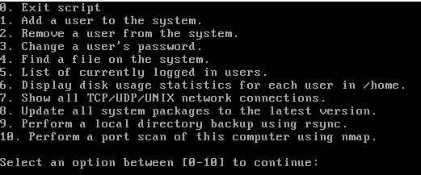
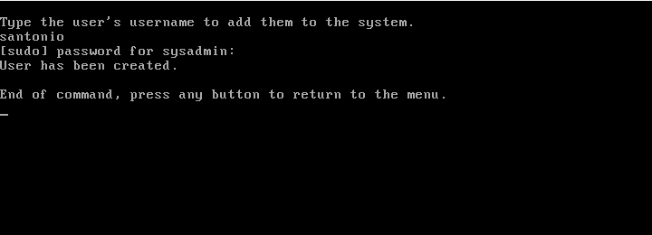
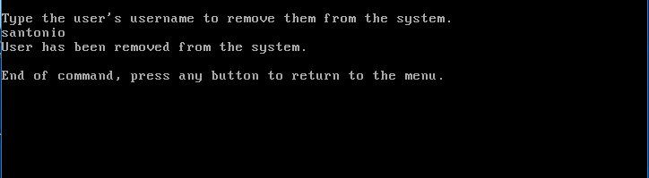
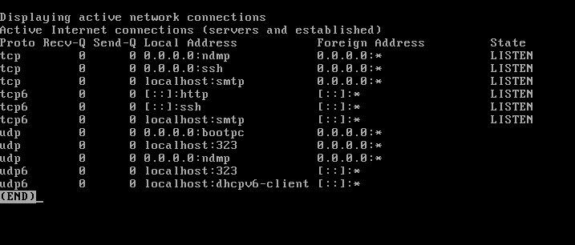

# Linux Administration Tool.sh
This BASH script is designed to assist you in administrating and monitoring a Linux distribution. Some features include adding and removing users, changing passwords, checking for failed login attempts and showing active network connections to your system. 

Tested on a Red Hat distribution (CentOS 7). Debian users should replace "yum" with "apt-get".

# **Installation :-**
1.	Install Git if you have not done so before:
> sudo yum -y install git
2.	Clone the repository locally and navigate there:
> git clone https://github.com/Kevin-Mould/Linux-Administration-Script.git

> cd linux-administration-script
3.	Make the script executable:
> chmod +x “Linux Administration Tool.sh”
4.	Change the Windows line endings copied from Git to Linux:
>  sed -i -e 's/\r$//' ‘Linux Administration Tool.sh’
5.	Run the shell script:
> ./”Linux Administration Tool.sh”

## **Install Additional Features :-**

•	Option 6, show active network connections requires the net tools package. If needed, install net tools:
> sudo yum -y install net-tools

Main menu of the script.

Adding a user to the system.

Delete a user from the system.

Show disk usage statistics.

Display network statistics.

