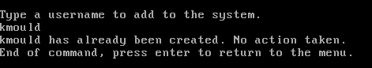

# Linux Administration Tool.sh
This BASH script runs useful commands that are helpful in configuring and monitoring a Red Hat Linux Distribution. This script offers user management servies to add, remove and change account passwords. It can also search your computer for specific files that you can specify and display the list of users currently logged in to the computer. Additionally, this script tracks the disk usage statistics for each user in the /home directory and displays a summary of TCP and UDP network connections. Advanced features include updating all system packages to the latest version, allowing you to input the absolute source and destination paths to perform a directory backup and using your IP address to launch an nmap vulnerability scan of your local computer. 

Commands in this script are designed for Red Hat Linux Distributions. Tested on CentOS 7.

# **Installation :-**
1.	Install Git:
> sudo yum -y install git
2.	Clone the repository locally and navigate there:
> git clone https://github.com/Kevin-Mould/Linux-Administration-Script.git

> cd linux-administration-script
3.	Make the script executable:
> chmod +x “Linux Administration Tool.sh”
4.	Change the Windows line endings (CRLF) to Linux line Endings (LF):
>  sed -i -e 's/\r$//' "Linux Administration Tool.sh"
5.	Run the shell script:
> ./”Linux Administration Tool.sh”

Main menu:

Option 1 - Add a user to the system, success/failure:

Option 2 - Remove a user from the system, success/failure:

Option 3 - Change the password to an account, success/failure:

Option 4 - Search for a file on the system:

Option 5 - Display the list of currently logged in users:

Option 6 - Display disk usage statistics for every user in the /home directory:

Option 7 - Show a summary of TCP/UDP network connections:

Option 8 - Update all system packages to the latest version:

Option 9 - Perform a directory backup using rsync:

Option 10 - Perform a port scan of this computer using nmap:

Error catching wildcard:

